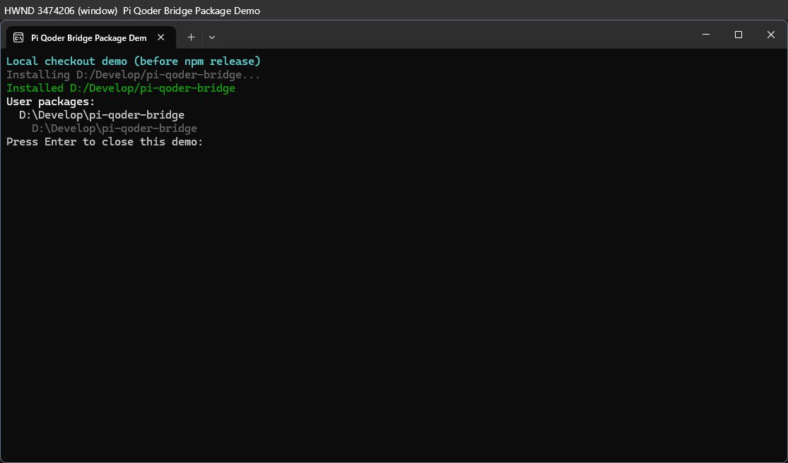
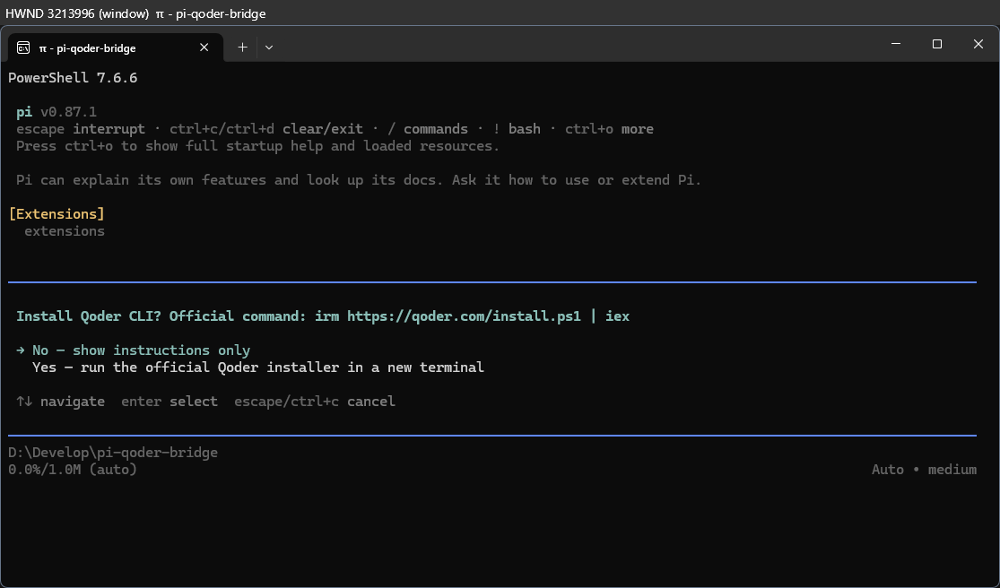

# Pi × Qoder 導入ガイド（0.1.0）

> まだ npm 未公開です。公開前は [README のローカル導入](../../README.md#try-a-local-checkout)を使ってください。公開後は下記の npm コマンドを使用できます。Qoder / Pi の公式製品ではありません。

## 1. インストール

Node.js 20 以上と Pi が必要です。Qoder Agent SDK のインストール時には Worker runtime を取得する `postinstall` の実行許可が必要です。

```sh
pi install npm:pi-qoder-agent-sdk-bridge@0.1.0
pi list
```

Piを再起動するか `/reload` を実行してください。


*公開前のローカルチェックアウトを隔離したPi設定で導入した実画面です。npm公開後はパッケージ名の表示が異なります。*

## 2. Qoder にログイン

Piで `/login` → **Qoder Bridge** を選びます。

- **Personal Access Token**：公式の [Account → Integrations](https://qoder.com/account/integrations) がブラウザで開きます。トークンを作成・コピーしてPiへ貼り付けます。PATはブラウザから自動取得できません。トークンをチャットやスクリーンショットに載せないでください。Piのログイン入力欄は端末環境により表示が隠されない可能性があるため、画面共有を止めて操作してください。
- **Reuse Qoder CLI login**：CLIが見つかる場合に表示されます。未ログインなら **Open browser via Qoder CLI** を選択し、CLI側のブラウザ認証を完了します。認証情報は公式CLI自身が保存し、ブリッジは保存済みログインの存在だけを確認します。ブラウザが開かない場合は **Run login in another terminal** を選択してください。

CLIが見つからない場合は `/qoder-bridge-setup` を使えます。最初の選択肢は **No — show instructions only**（既定でインストールしません）。**Yes** を明示的に選ぶとOSに合う公式インストールコマンドを別ターミナルで実行します。


*WindowsのPi実画面。認証情報を写さないため隔離したデモ設定を使用しており、インストーラーは実行していません。*

| OS / CPU | 公式コマンド | 備考 |
| --- | --- | --- |
| Windows x64 | `irm https://qoder.com/install.ps1 \| iex` | 別のPowerShellで実行 |
| macOS x64 / arm64 | `curl -fsSL https://qoder.com/install \| bash` | Terminal.app で実行 |
| Linux x64 / arm64 | `curl -fsSL https://qoder.com/install \| bash` | GUIと対応ターミナルが必要。無ければ表示されるコマンドを手動実行 |
| Windows arm64 / その他 | — | 自動導入は提供しません |

ダウンロードして実行する公式スクリプトの内容と利用条件を事前に確認してください。導入後は新しいターミナルで `qoder --version` を確認し、Piを再起動してください。`/qoder-bridge-status` でCLI検出・ローカルログインの有無を確認できます。

## 3. モデルを選択

Piで `/model` を開き、例えば **qoder-bridge/Auto** を選びます。最初は短い文章への応答で接続を確認してください。利用可能なモデルはQoderアカウントのプランや地域で異なります。静的なモデル一覧に表示されても利用できない場合があります。

## トラブルシューティング

| 症状 | 対処 |
| --- | --- |
| `Cannot find module '@qoder-ai/qoder-agent-sdk'` | パッケージディレクトリで `npm install`。SDKのpostinstallが許可されているか確認 |
| `No API key found for qoder-bridge` | `/login` → Qoder BridgeでPATまたはCLI方式を設定 |
| `No qodercli login found` | CLIのブラウザ認証を完了するかPAT方式を選択。CLIがPATH外にある場合もデスクトップ版同梱CLIを検出します |
| CLI導入後に見つからない | 新しいターミナルでPiを再起動し、`/qoder-bridge-status` を確認 |
| 別ターミナルが開かない | `/qoder-bridge-setup` の案内にある公式コマンドを自分の端末で実行 |

### スクリーンショットについて

上の画像は認証情報を使わない隔離環境で取得した実機キャプチャです。`/login` の入力画面はPATを表示するおそれがあるため掲載していません。デモの一時的な認証文字列は実際のQoder APIでは使えません。
